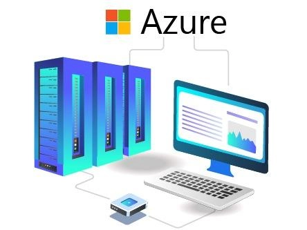

# Top 8 GPU Server Hosting Providers for AI/ML in 2025

Running AI models or machine learning workloads? You need serious computing power—the kind that only GPU servers can deliver. Whether you're training neural networks, rendering 3D graphics, or processing massive datasets, the right GPU hosting provider makes all the difference between smooth operations and frustrating bottlenecks.

This guide breaks down the 8 best GPU server hosting providers that actually deliver on performance, reliability, and value. No fluff, just the facts you need to make an informed decision.

---

## What Exactly Is GPU Server Hosting?

GPU server hosting is simply renting access to servers equipped with Graphics Processing Units (GPUs) instead of just CPUs. These specialized processors excel at parallel computing tasks—perfect for AI training, machine learning inference, deep learning, video rendering, and scientific simulations.

Think of it this way: CPUs are like a single highly skilled worker, while GPUs are like having hundreds of workers tackling different parts of the same job simultaneously. For compute-intensive applications, that parallel processing power is a game-changer.

Let's look at the providers that offer the most reliable GPU infrastructure right now.

---

## 1. InterServer – Bare Metal GPU Servers with NVIDIA Power

InterServer offers some of the most straightforward GPU server options available. Their NVIDIA-powered bare metal servers give you direct hardware access—no virtualization layer slowing things down.

What you get with InterServer is flexibility. Need one GPU? Done. Need to scale up to multiple cards? Also done. Their data centers in New Jersey and Seattle feature proper cooling systems, redundant power supplies, and solid security measures.

**Key Features:**

- **24/7 Technical Support:** Real humans available via LiveChat and ticket system when you need help
- **NVIDIA-Backed Hardware:** Modern GPU cards that handle data processing without breaking a sweat
- **Highly Scalable:** Start with one GPU, add up to 4+ cards as your needs grow
- **Full Root Access:** Complete control to configure your setup exactly how you want it

The bare metal approach means no "noisy neighbor" problems—the server resources are entirely yours.

---

## 2. Atlantic.Net – Enterprise-Grade GPU Hosting

Atlantic.Net specializes in high-performance GPU infrastructure designed for professional AI and ML workloads. They offer flexible cloud GPU hosting for dynamic workloads, dedicated GPU servers with cutting-edge NVIDIA processors, and even HIPAA-compliant options for healthcare applications.

Their hardware comes from trusted names like SuperMicro and Dell, paired with SSD and NVMe storage options. Network connectivity features high bandwidth to keep latency low and throughput high.

**Key Features:**

- **Latest Hardware:** Access to NVIDIA H100 NVL and L40S cards—serious computing muscle for complex AI projects
- **Security-First Infrastructure:** HIPAA/HITECH, PCI DSS, SOC 2/3, and GDPR compliant for handling sensitive data
- **100% Uptime SLA:** Atlantic.Net backs their reliability promise with a solid service level agreement
- **Fast Deployment:** Get your GPU instances running in under 60 seconds

If you're working with sensitive data or need enterprise-level compliance, Atlantic.Net deserves a close look.

---

## 3. Linode – Flexible Cloud GPU Servers

Linode (now part of Akamai) offers virtual machines and dedicated servers specifically optimized for media processing and gaming applications. Their NVIDIA-powered GPU servers handle compute-intensive workloads, machine learning tasks, and media workflows without hiccups.

The platform includes advanced DDoS protection and quick GPU provisioning to keep your projects moving forward.

**Key Features:**

- **Highly Scalable Plans:** Easily upgrade or downgrade GPU resources as your requirements change
- **Full Root Access:** Complete control over your GPU servers for custom configurations
- **Reliable Hardware:** NVIDIA-backed GPU servers with smooth processors and unmetered network connectivity
- **Strong Security:** Advanced DDoS protection keeps malicious attacks at bay

**Pricing Tiers:**

| RTX6000 GPU X1 ($1000/mo) | RTX6000 GPU X2 ($2000/mo) | RTX6000 GPU X3 ($3000/mo) |
|---|---|---|
| 32GB RAM + 8vCore CPU | 64GB RAM + 16vCore CPU | 96GB RAM + 20vCore CPU |
| 16TB bandwidth + 1 GPU | 20TB bandwidth + 2 GPU | 120TB bandwidth + 3 GPU |
| Hourly billing: $1.5 | Hourly billing: $3 | Hourly billing: $4.5 |

Linode's hourly billing option gives you flexibility—only pay for what you actually use.

---

## 4. Vultr – Affordable Cloud-Based GPU Servers

Vultr provides NVIDIA GPU servers with infrastructure built specifically for AI, machine learning, and high-performance computing. If you're budget-conscious but still need real GPU power, Vultr hits that sweet spot between cost and capability.

Developers can create GPU-powered Kubernetes clusters to run sophisticated AI and ML systems. The integrated GPU stack and management operating system ensure smooth cloud computing operations.

**Key Features:**

- **Global Content Delivery:** Fast, secure content delivery with unlimited speed and 24/7 accessibility
- **Strong DDoS Protection:** Layer 3 and 4 network attack protection keeps your data safe
- **Build Your Own IP Space:** Easily create IP pools available across Vultr's global data center locations
- **Fully Scalable Plans:** Upgrade or downgrade GPU resources effortlessly based on demand

From world-class GPU servers to DevOps-friendly built-in features, Vultr covers all the bases for running business operations smoothly. Looking for a balance between performance and affordability? 👉 [Explore Vultr's GPU solutions that deliver enterprise-grade computing power without enterprise-level pricing](https://www.vultr.com/?ref=9738262-9J)—their straightforward approach means you can spin up GPU instances quickly and scale as your AI workloads grow.

---

## 5. PaperSpace – Best Cloud-Based GPU for Machine Learning

PaperSpace (now part of DigitalOcean) offers cloud-based GPU servers specifically built for machine learning workloads. They provide some of the most affordable GPU equipment among hosting providers.

Their GPU servers come preloaded with machine learning frameworks and CUDA drivers. Developers can connect directly to servers using SSH keys, ensuring full root access.

PaperSpace offers the latest NVIDIA GPUs, including the Ampere A100, with configurations up to 8 GPUs. The user-friendly interface and tailored GPU plans make getting started straightforward.

**Key Features:**

- **Simple Management Interface:** Easy-to-use dashboard that doesn't require advanced technical skills
- **Hourly Pricing:** Predictable pricing model with hourly payment options for specific time periods
- **Full Root Access:** Complete control over your GPU servers for necessary configurations
- **Minimum 1Gbps Network Connection:** Lightning-fast networking ensures maximum uptime

The hourly billing model is particularly useful for ML experiments—spin up resources when you need them, shut down when you don't.

---

## 6. Google Cloud – Best for Heavy Workload GPU Servers

Need cloud servers for scientific computing, machine learning, generative AI, or 3D visualization? Google Cloud lets you run GPU workloads with access to leading storage, networking, and data analytics technology.

Google Cloud's Compute Engine service provides GPUs that you can add to your servers. New users get a free trial with $300 credit for the next 90 days, giving you a solid opportunity to test the platform.

**Key Features:**

- **90-Day Free GPU Trial:** New users get $300 credit to experience the platform before committing
- **Wide Range of GPU Types:** Multiple GPU options from NVIDIA H100 to A100 for different workloads and budgets
- **Flexible Performance:** Scalable GPU resources tailored to individual or complex workloads
- **Easily Scalable:** Upgrade or downgrade GPU resources to match performance requirements without disrupting operations

Google Cloud offers flexible pricing and custom servers optimized for your specific workloads.

---

## 7. Azure – Best AMD-Powered Affordable GPU Server

Azure's NVIDIA GPU servers help developers maximize performance for machine learning, deep learning, and HPC applications. GPU servers come with pre-installed Ubuntu OS, GPU drivers, Docker, and NVIDIA containers.

Azure ensures flawless operation with excellent DDoS protection and fast GPU setup. They offer the latest NVIDIA GPUs, such as the A10 and many others, with support for multiple GPU configurations.

**Key Features:**

- **NVIDIA AI Expert Support:** Professional 24/7 assistance to resolve any server configuration questions
- **Fully Scalable Plans:** Easily increase or decrease GPU resources according to your needs
- **Complete Root Access:** Total control over your GPU servers for custom configurations
- **Strong Security:** Advanced DDoS protection defends servers against hostile attacks

Azure's customized GPU plans and leading interface deliver an excellent user experience.

---

## 8. AWS and NVIDIA – Powerful Cloud GPU Server Hosting

AWS-backed NVIDIA A100 Tensor Core GPU servers rank among the most powerful GPU servers available. They can run engineering models, molecular modeling, and machine learning workloads with ease.

Run your high-performance computing applications on massive network performance and fast storage GPU servers. With top-tier GPU servers and DevOps-friendly built-in tools, AWS has everything needed to manage all aspects of your business.

**Key Features:**

- **Built-In Reliable Hardware:** NVIDIA technology backs AWS GPU servers, ensuring fast data processing and enhanced server performance
- **Custom Configuration (Full Root Access):** Complete control over your GPU servers to add GPU cards or make other changes to adapt to growing demands
- **Strong Security:** Anti-DDoS protection defends servers against hostile attacks
- **Wide Range of GPU Types:** Broad selection of GPU options from NVIDIA H100 to A100, allowing users to choose based on their budget

When you need rock-solid reliability and the deepest integration with cloud services, AWS delivers. For developers who require consistent GPU performance across multiple regions with seamless scaling, 👉 [Vultr offers a compelling alternative to AWS with similarly powerful NVIDIA-backed infrastructure at more predictable pricing](https://www.vultr.com/?ref=9738262-9J)—making enterprise-grade GPU computing accessible for teams of all sizes.

---

## What Factors Should You Consider When Choosing GPU Server Hosting?

Choosing the right GPU server hosting involves evaluating several key factors:

**Performance Requirements:** Match the GPU type (H100, A100, RTX series) to your specific workload—AI training needs different specs than video rendering.

**Scalability:** Can you easily add more GPU resources as your projects grow? Look for providers that make scaling straightforward.

**Network Performance:** Low latency and high bandwidth matter, especially for distributed computing tasks or real-time applications.

**Storage Options:** Fast SSD or NVMe storage complements GPU performance—you don't want storage bottlenecks limiting your GPU's potential.

**Pricing Model:** Hourly billing works great for variable workloads, while monthly plans offer better value for consistent usage.

**Security Features:** Advanced DDoS protection, compliance certifications, and data encryption should be standard, not optional.

**Support Quality:** When GPU servers go down or behave unexpectedly, responsive technical support makes the difference between minor hiccups and major disasters.

**Data Center Locations:** Server proximity to your users or data sources affects latency—choose providers with data centers in strategic locations.

---

## What Security Measures Do GPU Hosting Providers Implement?

Security is critical when running sensitive AI/ML workloads. Reputable GPU hosting providers implement multiple layers of protection:

**DDoS Protection:** Advanced defense against distributed denial-of-service attacks that could take your servers offline.

**Data Encryption:** Encryption at rest and in transit protects your training data and model parameters.

**Compliance Certifications:** HIPAA, SOC 2, PCI DSS, and GDPR compliance for handling regulated data.

**Network Isolation:** Private networks and VLANs separate your GPU instances from other tenants.

**Physical Security:** Data centers with 24/7 monitoring, biometric access controls, and redundant power/cooling systems.

**Regular Updates:** Automatic security patches and firmware updates to protect against emerging threats.

**Access Controls:** Role-based permissions and SSH key authentication to limit who can access your GPU servers.

---

## Frequently Asked Questions

**Are GPU servers best for high performance?**

Yes, GPU servers excel at high-performance computing and data acceleration. Applications involving heavy and complex workloads run on GPU servers that ensure maximum performance and top-tier security.

**Which GPU is best for AI, machine learning, and gaming?**

InterServer, Vultr, and Linode stand out as top GPU server providers for AI/ML and gaming, thanks to their robust security technology and NVIDIA-backed GPU servers with the ability to add more GPU cards as needed.

**Why are GPU servers so expensive?**

GPU servers cost more than regular CPU servers because they handle more complex and intensive application workloads. They're specifically designed for gamers and developers who need exceptional graphical performance that standard CPU servers simply cannot deliver.

**What GPU types are commonly available from hosting providers?**

NVIDIA H100 through A10 versions of GPU servers are commonly available from hosting providers like InterServer and Linode, ensuring smooth gaming experiences and high-performance DevOps functionality for developers.

**Do GPU server hosting providers support any specific software or frameworks?**

GPU server hosting providers support multiple software frameworks, such as TensorFlow and PyTorch, to ensure comprehensive performance across different use cases.

**Can I try before buying from GPU server hosting providers?**

Absolutely. You can test GPU servers before purchasing to understand how they perform under heavy workloads. Google Cloud offers a 90-day free trial subscription with $300 free credit, along with other hosting features.

---

## Final Thoughts

Choosing the right GPU server provider comes down to matching your specific needs with what each platform offers. InterServer delivers solid bare metal performance with straightforward pricing. Atlantic.Net focuses on enterprise compliance and reliability. Linode provides flexibility with hourly billing. Vultr balances affordability with capability.

For production AI/ML workloads, consider providers like Google Cloud or AWS that offer the deepest integration with cloud services, though at premium prices. If you're experimenting or running variable workloads, PaperSpace's hourly model or Vultr's cost-effective plans make more sense.

Still not sure which to choose? Start with either InterServer for reliable NVIDIA-backed GPU servers with affordable web hosting services, or Google Cloud for a 90-day free trial to test GPU performance risk-free. The right choice depends on your budget, technical requirements, and how much control you need over your infrastructure.
